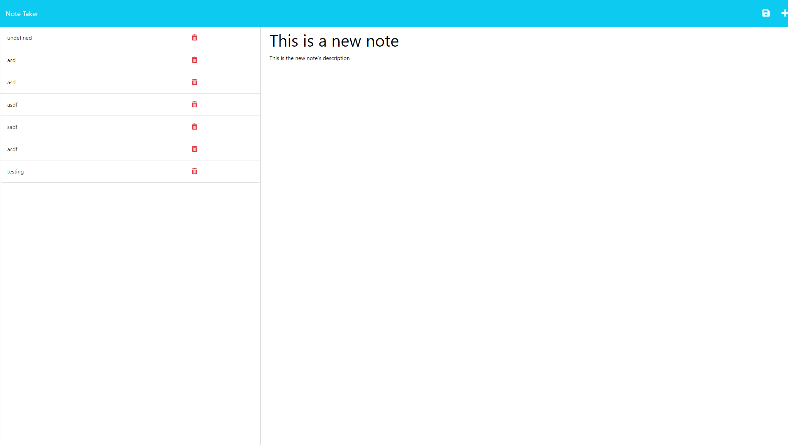

# Note taker

## Description
This application allows users to dynamically document and save notes

## Installation Instructions
run npm install in the project directory!

## Usage Information
Use as much as you like!

## Contribution Guidelines
N/A

## Testing Instructions
Test as much as you want, break it if you can!

## License 
https://opensource.org/licenses/MIT

## Github Username
acarter867

## Email Address
acarter867@icloud.com

## Preview

